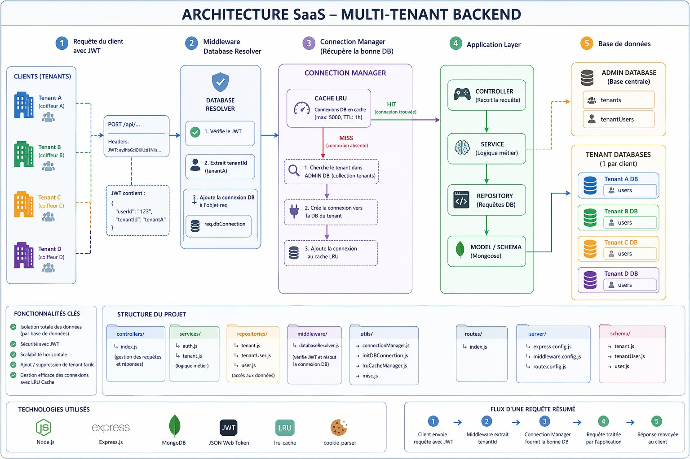
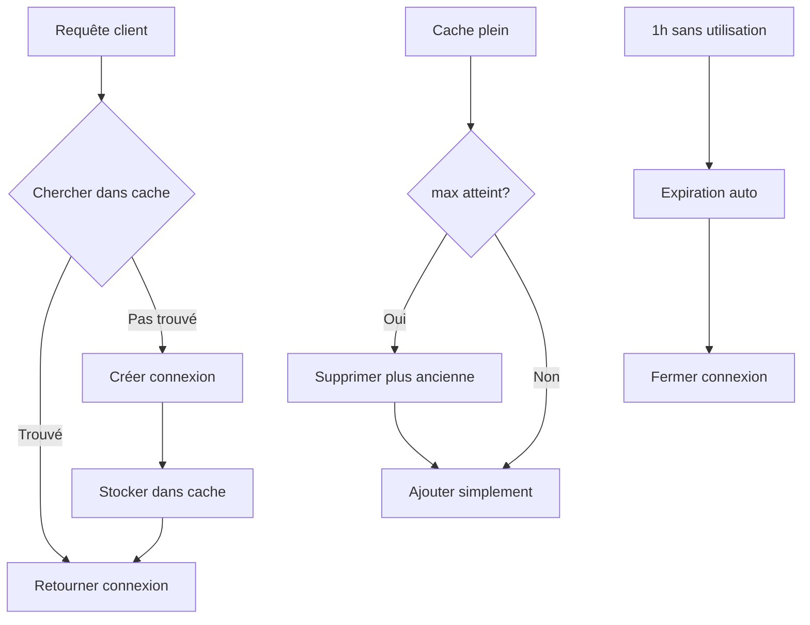

# Multi-Tenant Backend — express js + MongoDB

A multi-tenant REST API built with **Node.js**, **Express**, and **MongoDB**. Each tenant has its own isolated database, with a shared admin database managing tenant registry and user routing.

---

## Architecture



This backend follows a **SaaS multi-tenant architecture** where each client (tenant) has a completely isolated MongoDB database. A central `super_admin` database acts as the registry and routing layer, while an LRU cache ensures efficient connection management at scale.

---

### ① Client — Sending Requests with JWT

Every tenant (Tenant A, B, C, D...) represents a separate business — for example a tenantA, tenantB. Each tenant's users authenticate and receive a **JWT token** that encodes two key pieces of information:

```json
{
  "userId": "123",
  "tenantId": "tenantA"
}
```

This token is attached to every subsequent request in the `jwt` header. It tells the backend **who** is making the request and **which tenant** they belong to — without needing any session state on the server.

---

### ② Middleware — Database Resolver

The `databaseResolver` middleware runs on **every incoming request** before it reaches any controller. Its job is to:

1. **Verify the JWT** — if the token is missing, expired, or invalid, the request is rejected immediately with a 401 error
2. **Extract the `tenantId`** from the token payload (e.g. `tenantA`)
3. **Resolve the correct database connection** for that tenant via the Connection Manager
4. **Inject the connection** into `req.dbConnection` so controllers and repositories can use it downstream

Public routes (`/api/login` and `/api/add`) bypass this middleware entirely — they don't require a token.

---

### ③ Connection Manager — Getting the Right Database

The Connection Manager is the brain of the multi-tenant routing. When the middleware asks for a tenant's DB connection, it follows this logic:

**Cache HIT** (fast path):
- The tenant's connection already exists in the LRU cache
- Returns it immediately — no DB lookup needed

**Cache MISS** (slow path):
1. Queries the `super_admin` database → `tenants` collection to find the tenant's `dbUri`
2. Creates a new Mongoose connection to that tenant's MongoDB database
3. Stores the new connection in the LRU cache for future requests
4. Returns the connection

The LRU cache is configured with a maximum of **5,000 connections** and a **TTL of 1 hour** — connections unused for over an hour are automatically evicted to free memory.

---

### ④ Application Layer — Controller / Service / Repository

Once the correct DB connection is resolved and injected into the request, the standard layered architecture takes over:

- **Controller** — receives the HTTP request, calls the appropriate service, returns the HTTP response. Contains no business logic.
- **Service** — contains all business logic (validation, hashing, token generation, orchestration). Calls one or more repositories.
- **Repository** — the only layer that directly talks to MongoDB via Mongoose. Receives a DB connection and a query, returns raw data.
- **Model / Schema** — Mongoose schema definitions that describe the shape of documents in each collection.

This separation ensures that each layer has a single responsibility and can be tested or replaced independently.

---

### ⑤ Databases — Admin DB + Tenant DBs

**`super_admin` DB** (one, shared):
- `tenants` collection — stores each tenant's name and `dbUri` (the MongoDB connection string for their dedicated database)
- `tenantusers` collection — maps user emails to their `tenantId`, used during login to route the user to the correct tenant database

**Tenant DBs** (one per client, fully isolated):
- Each tenant has their own MongoDB database (e.g. `tenantA`, `tenantB`)
- Contains a `users` collection with hashed passwords
- Data from one tenant is completely invisible to another — no shared collections, no risk of data leaks between clients

---

### Database Structure

```
super_admin DB (MongoDB)
├── tenants        → tenant registry (name, dbUri)
└── tenantusers    → maps user emails to their tenantId

tenantA DB (MongoDB)
└── users          → tenant A's users (email + hashed password)

tenantB DB (MongoDB)
└── users          → tenant B's users (email + hashed password)
```

---

### Request Flow — Login & Protected Route

```
Client          Middleware      DB Resolver       Cache        Super Admin      Tenant DB
  │                 │                │               │              │               │
  │ POST /login     │                │               │              │               │
  ├────────────────►│                │               │              │               │
  │                 │ Skip resolver  │               │              │               │
  │                 ├───────────────►│               │              │               │
  │                 │                │ Verify user   │              │               │
  │                 │                ├───────────────┼─────────────►│               │
  │                 │                │               │              │  Get user     │
  │                 │                │               │              ├──────────────►│
  │                 │                │               │              │               │
  │   JWT token     │                │               │              │               │
  │◄────────────────┤                │               │              │               │
  │                 │                │               │              │               │
  │ GET /users      │                │               │              │               │
  │ (JWT header)    │                │               │              │               │
  ├────────────────►│                │               │              │               │
  │                 │ Decode JWT     │               │              │               │
  │                 │ tenantId=abc   │               │              │               │
  │                 ├───────────────►│               │              │               │
  │                 │                │ Get connection│              │               │
  │                 │                │ for abc       │              │               │
  │                 │                ├──────────────►│              │               │
  │                 │                │ Cache miss?   │              │               │
  │                 │                │   No (hit)    │              │               │
  │                 │                │◄──────────────┤              │               │
  │                 │                │ Return conn   │              │               │
  │                 │                │               │              │               │
  │                 │                │ Query users   │              │               │
  │                 │                ├───────────────┼──────────────┼──────────────►│
  │                 │                │               │              │               │
  │   User data     │                │               │              │               │
  │◄────────────────┼────────────────┼───────────────┼──────────────┼───────────────┤
  │                 │                │               │              │               │
```

---

### LRU Cache — Connection Manager Logic



---

##  Project Structure

```
├── Controllers/
│   └── index.js              # loginController, addATenantController
├── middleware/
│   ├── databaseResolver.js   # JWT verification + DB connection injection
│   └── middleware.config.js  # middleware registration
├── Repositories/
│   ├── tenant.js             # CRUD for tenants collection
│   ├── tenantUser.js         # CRUD for tenantusers collection
│   └── user.js               # CRUD for users collection
├── routes/
│   └── index.js              # API route definitions
├── Schema/
│   ├── tenant.js             # Mongoose schema — tenants
│   ├── tenantUser.js         # Mongoose schema — tenantusers
│   └── users.js              # Mongoose schema — users
├── Server/
│   ├── express.config.js     # Express app setup
│   └── route.config.js       # Route mounting
├── services/
│   ├── auth.js               # loginService
│   └── tenant.js             # addATenantService
├── Utils/
│   ├── connectionManager.js  # DB connection pool + LRU cache
│   ├── initDBConnection.js   # Mongoose connection initializer
│   ├── lruCacheManager.js    # LRU cache for tenant connections
│   └── misc.js               # JWT sign/verify, bcrypt hash/compare
└── index.js                  # App entry point
```

---

## Prerequisites

- **Node.js** v18+
- **MongoDB** running as a **Replica Set** (required for transactions)

### Setting up MongoDB as a Replica Set (local)

1. Edit `mongod.cfg`:
```yaml
replication:
  replSetName: "rs0"
```

2. Restart MongoDB:
```powershell
net stop MongoDB
net start MongoDB
```

3. Initialize the replica set (run once in `mongosh`):
```js
rs.initiate()
```

---

## Installation

```bash
cd multi-tenant
npm install
```

Create a `.env` file at the root:
```env
PORT=5000
```

Start the server:
```bash
node index.js
```

---

## 🔌 API Endpoints

### `POST /api/add` — Create a Tenant

Creates a new tenant with its own isolated database and an initial admin user.

**Request Body:**
```json
{
  "name": "tenantA",
  "dbUri": "mongodb://localhost:27017/tenantA",
  "email": "admin@a.com",
  "password": "secret123"
}
```

**Response:**
```json
{
  "success": true,
  "statusCode": 201,
  "message": "Locataire ajouté avec succès",
  "responseObject": {
    "tenantId": "664abc...",
    "userId": "664def..."
  }
}
```

---

### `POST /api/login` — Login

Authenticates a user and returns a JWT token.

**Request Body:**
```json
{
  "email": "admin@a.com",
  "password": "secret123"
}
```

**Response:**
```json
{
  "success": true,
  "statusCode": 200,
  "message": "Connecté avec succès",
  "responseObject": {
    "accessToken": "eyJhbGci...",
    "userId": "664def...",
    "tenantId": "664abc..."
  }
}

```

---

### Protected Routes

All routes except `/api/add` and `/api/login` require a JWT in the request headers:

```
jwt: eyJhbGci...
```

The `databaseResolver` middleware automatically:
1. Verifies the JWT
2. Resolves the correct tenant database connection
3. Injects it into `req.dbConnection`

---
